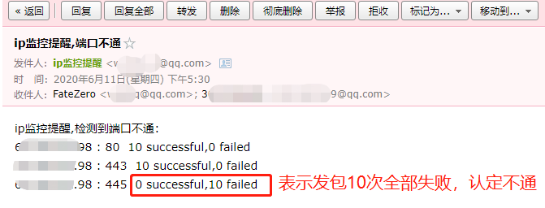

# ip_watcher
基于tcping的端口监控程序，监测端口不通可邮件报警提醒
# use
1. 更改ip_watcher.yaml中的mail_user和mail_passwd为qq邮箱的账号和授权码，来确保能正常发送邮件
2. ip_watcher.yaml中的common_ports为单个端口添加，max_port和min_port为批量端口添加（例：common_ports为80，min_port为443，max_port为445。则监控80、443、444、445端口）
3. ip.txt中添加需要监控的ip，每行一个。
# result

